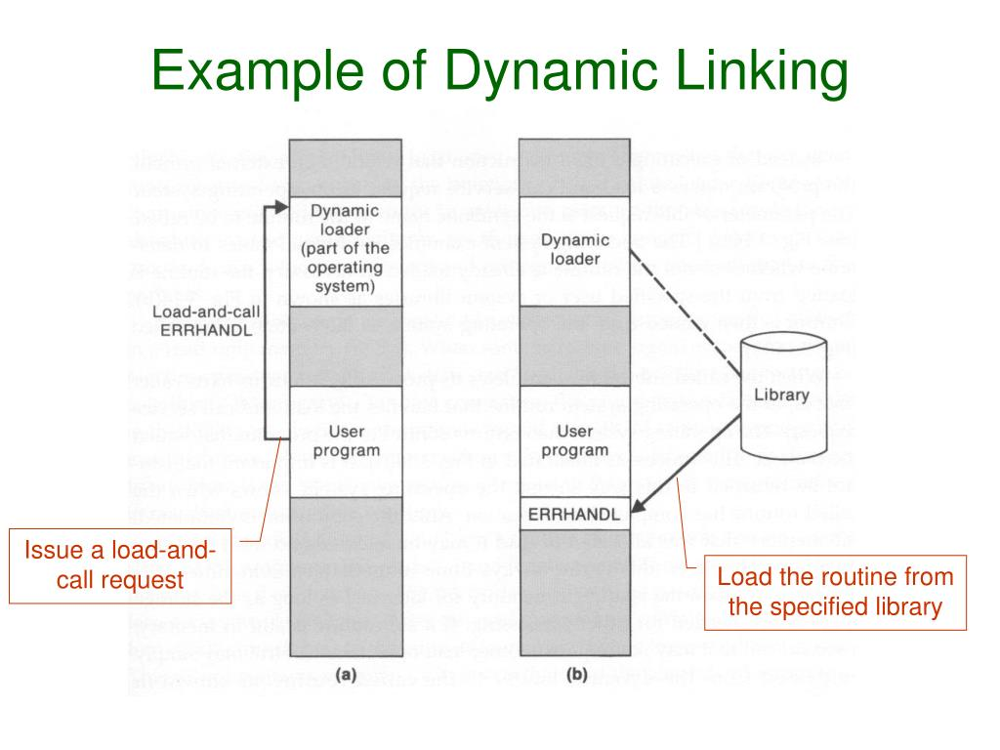
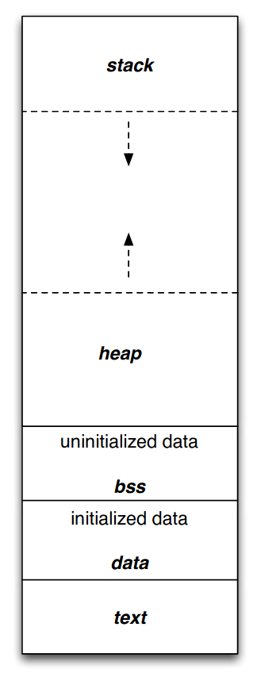

# OpenFingerTestApp
Software for testing OpenFinger library suite.

# Useful information

## Static and dynamic libraries

Well-written sources:

 * https://www.bogotobogo.com/cplusplus/libraries.php
 * https://www.bottomupcs.com/chapter08.xhtml

### Static linking
Static linking is the process of copying all library modules used in the program into the final executable image. This is performed by the linker and it is done as the last step of the compilation process. The linker combines library routines with the program code in order to resolve external references, and to generate an executable image suitable for loading into memory. When the program is loaded, the operating system places into memory a single file that contains the executable code and data. This statically linked file includes both the calling program and the called program. 

### Dynamic linking
In dynamic linking the names of the external libraries (shared libraries) are placed in the final executable file while the actual linking takes place at run time when both executable file and libraries are placed in the memory. Dynamic linking lets several programs use a single copy of an executable module. 

## Process virtual address space

